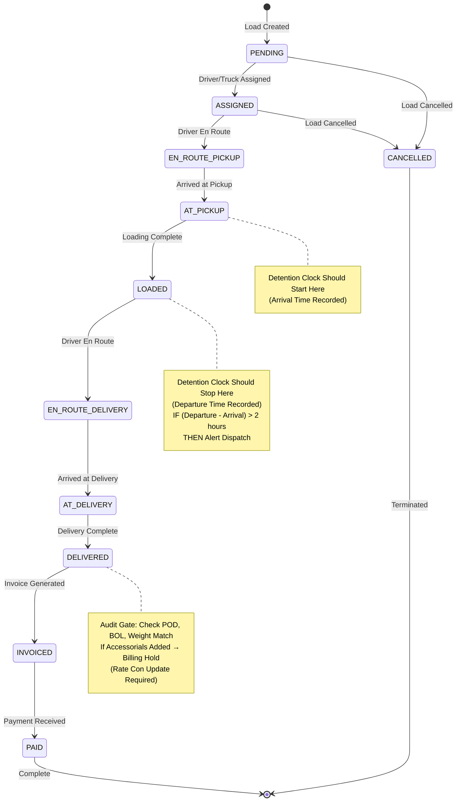
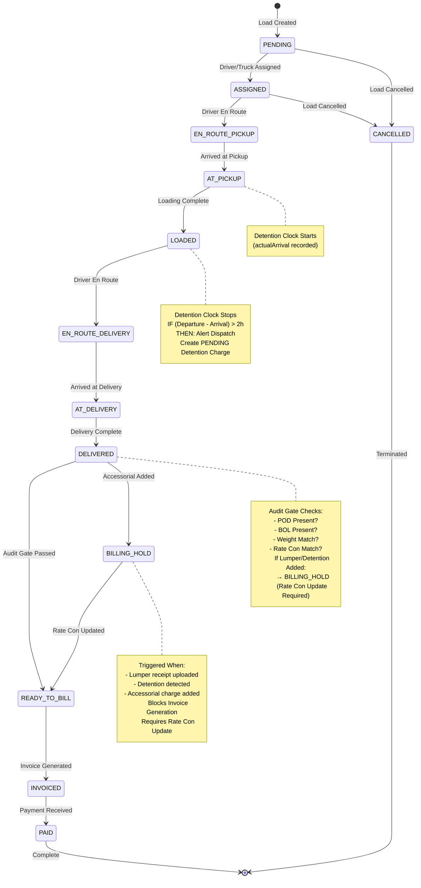

# Load Status State Machine Audit Report

**Date:** 2025-01-27  
**Auditor:** Senior Database Architect  
**Scope:** Load status transitions, Detention Clock logic, Billing Hold status

---

## Executive Summary

**Status:** ⚠️ **PARTIALLY IMPLEMENTED**

### Findings:
1. ✅ **Load Status State Machine:** Fully implemented with clear transitions
2. ❌ **Detention Clock Logic:** **MISSING** - No automatic detection of detention time
3. ❌ **Billing Hold Status:** **MISSING** - No status to warn accounting when Rate Con needs update

---

## 1. Load Status State Machine

### Current Implementation

**Status Enum:**
```442:454:prisma/schema.prisma
enum LoadStatus {
  PENDING
  ASSIGNED
  EN_ROUTE_PICKUP
  AT_PICKUP
  LOADED
  EN_ROUTE_DELIVERY
  AT_DELIVERY
  DELIVERED
  INVOICED
  PAID
  CANCELLED
}
```

**Status Transitions (from `LoadStatusQuickActions.tsx`):**
```34:46:components/loads/LoadStatusQuickActions.tsx
const statusTransitions: Record<LoadStatus, LoadStatus[]> = {
  PENDING: ['ASSIGNED', 'CANCELLED'],
  ASSIGNED: ['EN_ROUTE_PICKUP', 'CANCELLED'],
  EN_ROUTE_PICKUP: ['AT_PICKUP'],
  AT_PICKUP: ['LOADED'],
  LOADED: ['EN_ROUTE_DELIVERY'],
  EN_ROUTE_DELIVERY: ['AT_DELIVERY'],
  AT_DELIVERY: ['DELIVERED'],
  DELIVERED: ['INVOICED'],
  INVOICED: ['PAID'],
  PAID: [],
  CANCELLED: [],
};
```

### Visual State Machine Diagram



### Status Flow Analysis

**✅ Strengths:**
- Clear linear progression from creation to payment
- Proper cancellation path
- Status history tracking exists (`LoadStatusHistory` model)
- Auto-update logic exists (`lib/automation/load-status.ts`)

**⚠️ Gaps Identified:**
1. **Missing "READY_TO_BILL" status** - According to TMS spec, there should be an audit gate between DELIVERED and INVOICED
2. **No "BILLING_HOLD" status** - Needed when Rate Con requires update
3. **No automatic status transitions** based on business rules (detention, POD upload, etc.)

---

## 2. Detention Clock Logic - ❌ **MISSING**

### Requirement (from TMS Logic Spec)

> **Detention Logic:**  
> IF (Depart - Arrive) > 2 hours THEN Alert Dispatch.  
> Critical Check: Do not auto-add this to the Invoice. It requires a revised Rate Confirmation from the broker.

### Current State

**✅ What EXISTS:**
1. `LoadStop` model has timing fields:
   ```392:395:prisma/schema.prisma
     earliestArrival DateTime?
     latestArrival   DateTime?
     actualArrival   DateTime?
     actualDeparture DateTime?
   ```

2. `AccessorialCharge` model supports detention:
   ```2426:2428:prisma/schema.prisma
     // Detention specific
     detentionHours Float?
     detentionRate  Float?
   ```

**❌ What's MISSING:**
1. **No automatic calculation** of detention hours
2. **No comparison logic** that checks `(actualDeparture - actualArrival) > 2 hours`
3. **No alert system** to notify dispatch when detention threshold exceeded
4. **No automatic creation** of detention accessorial charge

### Expected Behavior

**When `actualDeparture` is recorded:**
1. Calculate: `detentionHours = (actualDeparture - actualArrival) - 2 hours free time`
2. If `detentionHours > 0`:
   - Alert dispatch (notification)
   - Create `AccessorialCharge` with:
     - `chargeType: DETENTION`
     - `status: PENDING` (requires approval)
     - `detentionHours: calculated value`
   - **DO NOT** auto-add to invoice (requires Rate Con update)

### Code Location Needed

**Recommended Implementation:**
- **File:** `lib/managers/DetentionManager.ts` (NEW)
- **Trigger:** When `LoadStop.actualDeparture` is updated
- **Logic:** Compare against `actualArrival` and 2-hour free time threshold

**Example Logic:**
```typescript
async function checkDetention(loadStopId: string): Promise<void> {
  const stop = await prisma.loadStop.findUnique({
    where: { id: loadStopId },
    include: { load: true }
  });

  if (!stop.actualArrival || !stop.actualDeparture) {
    return; // Can't calculate without both times
  }

  const arrivalTime = new Date(stop.actualArrival);
  const departureTime = new Date(stop.actualDeparture);
  const freeTimeHours = 2; // Configurable per customer/load
  
  const totalHours = (departureTime.getTime() - arrivalTime.getTime()) / (1000 * 60 * 60);
  const detentionHours = Math.max(0, totalHours - freeTimeHours);

  if (detentionHours > 0) {
    // Alert dispatch
    await notifyDetentionDetected(stop.loadId, detentionHours);
    
    // Create pending accessorial charge
    await prisma.accessorialCharge.create({
      data: {
        companyId: stop.load.companyId,
        loadId: stop.loadId,
        chargeType: 'DETENTION',
        detentionHours,
        status: 'PENDING', // Requires approval
        description: `Detention: ${detentionHours.toFixed(2)} hours`,
        amount: 0, // Will be calculated after rate is confirmed
      }
    });
  }
}
```

---

## 3. Billing Hold Status - ❌ **MISSING**

### Requirement (from TMS Logic Spec)

> **Critical Check:** Do not auto-add this to the Invoice. It requires a revised Rate Confirmation from the broker. Create a "Billing Hold" status until the new Rate Con is received.

### Current State

**✅ What EXISTS:**
1. `AccountingSyncStatus` enum:
   ```469:475:prisma/schema.prisma
   enum AccountingSyncStatus {
     NOT_SYNCED
     PENDING_SYNC
     SYNCED
     SYNC_FAILED
     REQUIRES_REVIEW
   }
   ```

2. `AccessorialCharge` model with approval workflow:
   ```2440:2445:prisma/schema.prisma
     status AccessorialChargeStatus @default(PENDING)

     // Approval
     approvedById String?
     approvedBy   User?     @relation(fields: [approvedById], references: [id])
     approvedAt   DateTime?
   ```

**❌ What's MISSING:**
1. **No "BILLING_HOLD" status** in `LoadStatus` enum
2. **No automatic status change** when lumper receipt is uploaded
3. **No logic** that prevents invoicing when Rate Con needs update
4. **No warning system** for accounting department

### Expected Behavior

**When Lumper Receipt Uploaded:**
1. Driver uploads lumper receipt (document type: `LUMPER_RECEIPT`)
2. System should:
   - Create `AccessorialCharge` with `chargeType: LUMPER`, `status: PENDING`
   - **Change Load status to `BILLING_HOLD`** (or set `accountingSyncStatus: REQUIRES_REVIEW`)
   - Notify accounting: "Rate Con update required - Lumper fee added"
   - Block invoice generation until Rate Con is updated

**When Detention Detected:**
1. Same flow as above
2. Load cannot move to `INVOICED` until:
   - New Rate Con uploaded with updated total
   - Accessorial charges approved
   - Billing hold cleared

### Recommended Implementation

**Option 1: Add BILLING_HOLD to LoadStatus enum** (Recommended)
```prisma
enum LoadStatus {
  PENDING
  ASSIGNED
  EN_ROUTE_PICKUP
  AT_PICKUP
  LOADED
  EN_ROUTE_DELIVERY
  AT_DELIVERY
  DELIVERED
  BILLING_HOLD      // NEW: Rate Con update required
  READY_TO_BILL     // NEW: Passed audit gate
  INVOICED
  PAID
  CANCELLED
}
```

**Option 2: Use AccountingSyncStatus** (Alternative)
- Keep `LoadStatus: DELIVERED`
- Set `accountingSyncStatus: REQUIRES_REVIEW` when billing hold needed
- Add UI indicator for "Billing Hold" state

**Recommended Code Changes:**

**File:** `app/api/accessorial-charges/route.ts`
```typescript
// After creating accessorial charge (line 179-207)
// Add billing hold logic:

if (chargeType === 'LUMPER' || chargeType === 'DETENTION') {
  // Check if load is in a state that requires Rate Con update
  const load = await prisma.load.findUnique({
    where: { id: loadId },
    include: { rateConfirmation: true }
  });

  if (load.status === 'DELIVERED' || load.status === 'READY_TO_BILL') {
    // Set billing hold
    await prisma.load.update({
      where: { id: loadId },
      data: {
        status: 'BILLING_HOLD', // or accountingSyncStatus: 'REQUIRES_REVIEW'
      }
    });

    // Notify accounting
    await notifyBillingHold({
      loadId,
      loadNumber: load.loadNumber,
      reason: `${chargeType} charge added - Rate Con update required`,
      accessorialChargeId: charge.id,
    });
  }
}
```

**File:** `app/api/invoices/route.ts` (Invoice creation)
```typescript
// Before creating invoice, check for billing hold:
const load = await prisma.load.findUnique({
  where: { id: loadId },
  include: {
    accessorialCharges: {
      where: {
        status: 'PENDING',
        chargeType: { in: ['LUMPER', 'DETENTION'] }
      }
    },
    rateConfirmation: true
  }
});

if (load.status === 'BILLING_HOLD') {
  return NextResponse.json(
    {
      success: false,
      error: {
        code: 'BILLING_HOLD',
        message: 'Cannot create invoice: Rate Con update required due to pending accessorial charges',
        pendingCharges: load.accessorialCharges,
      }
    },
    { status: 400 }
  );
}
```

---

## 4. Updated State Machine with Missing States

### Complete State Machine (Including Recommended Additions)



---

## 5. Implementation Priority

### Priority 1: Critical Missing Features

#### 1.1 Detention Clock Logic
**Status:** ❌ **MISSING**  
**Priority:** 🔴 **HIGH**

**Tasks:**
- [ ] Create `DetentionManager` class
- [ ] Add logic to calculate detention hours when `actualDeparture` is set
- [ ] Implement 2-hour free time threshold (configurable per customer)
- [ ] Auto-create `AccessorialCharge` with `DETENTION` type
- [ ] Add notification to dispatch when detention detected
- [ ] Ensure detention charges are NOT auto-added to invoice

**Files to Create/Modify:**
- `lib/managers/DetentionManager.ts` (NEW)
- `app/api/loads/[id]/stops/[stopId]/route.ts` (MODIFY - add detention check on departure update)
- `lib/notifications/triggers.ts` (MODIFY - add `notifyDetentionDetected`)

#### 1.2 Billing Hold Status
**Status:** ❌ **MISSING**  
**Priority:** 🔴 **HIGH**

**Tasks:**
- [ ] Add `BILLING_HOLD` to `LoadStatus` enum (or use `accountingSyncStatus`)
- [ ] Add `READY_TO_BILL` status (audit gate passed)
- [ ] Update status transitions to include new states
- [ ] Add logic to set `BILLING_HOLD` when lumper/detention charges added
- [ ] Block invoice generation when load is in `BILLING_HOLD`
- [ ] Add notification to accounting when billing hold triggered
- [ ] Add logic to clear billing hold when Rate Con updated

**Files to Create/Modify:**
- `prisma/schema.prisma` (MODIFY - add enum values)
- `app/api/accessorial-charges/route.ts` (MODIFY - add billing hold logic)
- `app/api/invoices/route.ts` (MODIFY - check for billing hold)
- `app/api/rate-confirmations/[id]/route.ts` (MODIFY - clear billing hold on update)
- `components/loads/LoadStatusQuickActions.tsx` (MODIFY - add new transitions)

---

## 6. Code Examples

### Detention Detection Logic

```typescript
// lib/managers/DetentionManager.ts
import { prisma } from '@/lib/prisma';
import { notifyDetentionDetected } from '@/lib/notifications/triggers';

export class DetentionManager {
  private readonly FREE_TIME_HOURS = 2; // Default free time

  /**
   * Check for detention when departure time is recorded
   */
  async checkDetentionOnDeparture(
    loadStopId: string,
    freeTimeHours: number = this.FREE_TIME_HOURS
  ): Promise<void> {
    const stop = await prisma.loadStop.findUnique({
      where: { id: loadStopId },
      include: {
        load: {
          include: {
            customer: true,
          },
        },
      },
    });

    if (!stop?.actualArrival || !stop?.actualDeparture) {
      return; // Can't calculate without both times
    }

    const arrivalTime = new Date(stop.actualArrival);
    const departureTime = new Date(stop.actualDeparture);
    
    // Calculate total time in hours
    const totalHours = 
      (departureTime.getTime() - arrivalTime.getTime()) / (1000 * 60 * 60);
    
    // Calculate detention hours (excess beyond free time)
    const detentionHours = Math.max(0, totalHours - freeTimeHours);

    if (detentionHours > 0) {
      // Get customer-specific detention rate (if configured)
      const detentionRate = stop.load.customer.detentionRate || 50; // Default $50/hour

      // Check if detention charge already exists
      const existingCharge = await prisma.accessorialCharge.findFirst({
        where: {
          loadId: stop.loadId,
          chargeType: 'DETENTION',
          status: { in: ['PENDING', 'APPROVED'] },
        },
      });

      if (!existingCharge) {
        // Create pending detention charge
        await prisma.accessorialCharge.create({
          data: {
            companyId: stop.load.companyId,
            loadId: stop.loadId,
            chargeType: 'DETENTION',
            detentionHours,
            detentionRate,
            amount: detentionHours * detentionRate,
            status: 'PENDING', // Requires approval
            description: `Detention: ${detentionHours.toFixed(2)} hours at ${stop.company || 'location'}`,
            notes: `Auto-detected: Arrival ${arrivalTime.toISOString()}, Departure ${departureTime.toISOString()}`,
          },
        });

        // Alert dispatch
        await notifyDetentionDetected({
          loadId: stop.loadId,
          loadNumber: stop.load.loadNumber,
          detentionHours,
          location: stop.company || stop.address,
        });

        // Set billing hold if load is delivered
        if (stop.load.status === 'DELIVERED' || stop.load.status === 'READY_TO_BILL') {
          await this.setBillingHold(stop.loadId, 'Detention charge detected - Rate Con update required');
        }
      }
    }
  }

  /**
   * Set billing hold on load
   */
  private async setBillingHold(loadId: string, reason: string): Promise<void> {
    await prisma.load.update({
      where: { id: loadId },
      data: {
        status: 'BILLING_HOLD', // or accountingSyncStatus: 'REQUIRES_REVIEW'
        dispatchNotes: `${reason}\n${new Date().toISOString()}`,
      },
    });
  }
}
```

### Billing Hold Logic

```typescript
// app/api/accessorial-charges/route.ts
// Add after line 207 (after charge creation):

// Check if this charge type requires Rate Con update
const requiresRateConUpdate = ['LUMPER', 'DETENTION'].includes(chargeType);

if (requiresRateConUpdate) {
  const load = await prisma.load.findUnique({
    where: { id: loadId },
    include: {
      rateConfirmation: true,
      accessorialCharges: {
        where: {
          status: 'PENDING',
          chargeType: { in: ['LUMPER', 'DETENTION'] },
        },
      },
    },
  });

  // Set billing hold if load is delivered or ready to bill
  if (load && (load.status === 'DELIVERED' || load.status === 'READY_TO_BILL')) {
    await prisma.load.update({
      where: { id: loadId },
      data: {
        status: 'BILLING_HOLD',
        dispatchNotes: `Billing Hold: ${chargeType} charge added. Rate Con update required before invoicing.\n${new Date().toISOString()}`,
      },
    });

    // Notify accounting
    await notifyBillingHold({
      loadId,
      loadNumber: load.loadNumber,
      reason: `${chargeType} charge added - Rate Con update required`,
      accessorialChargeId: charge.id,
      customerName: load.customer.name,
    });
  }
}
```

---

## 7. Summary & Recommendations

### Critical Gaps

1. **❌ Detention Clock:** No automatic detection when `(Departure - Arrival) > 2 hours`
2. **❌ Billing Hold:** No status to prevent invoicing when Rate Con needs update
3. **❌ Audit Gate:** Missing `READY_TO_BILL` status between `DELIVERED` and `INVOICED`

### Implementation Roadmap

**Phase 1: Detention Detection (Week 1)**
- Create `DetentionManager`
- Add detention calculation on stop departure
- Add dispatch notifications

**Phase 2: Billing Hold (Week 1-2)**
- Add `BILLING_HOLD` and `READY_TO_BILL` statuses
- Update accessorial charge creation logic
- Block invoice generation when on hold
- Add Rate Con update workflow

**Phase 3: Audit Gate (Week 2)**
- Implement audit gate checks (POD, BOL, Weight match)
- Add `READY_TO_BILL` transition logic
- Update UI to show audit gate status

### Next Steps

1. ✅ Review this audit with operations/accounting team
2. ✅ Confirm detention free time threshold (2 hours standard?)
3. ✅ Confirm billing hold workflow requirements
4. ✅ Generate Prisma migration for new statuses
5. ✅ Implement `DetentionManager`
6. ✅ Update accessorial charge creation logic
7. ✅ Add billing hold checks to invoice generation
8. ✅ Update UI components for new statuses

---

**End of Audit Report**


