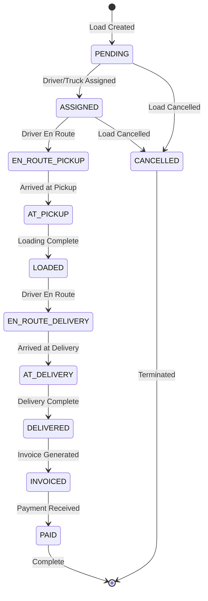
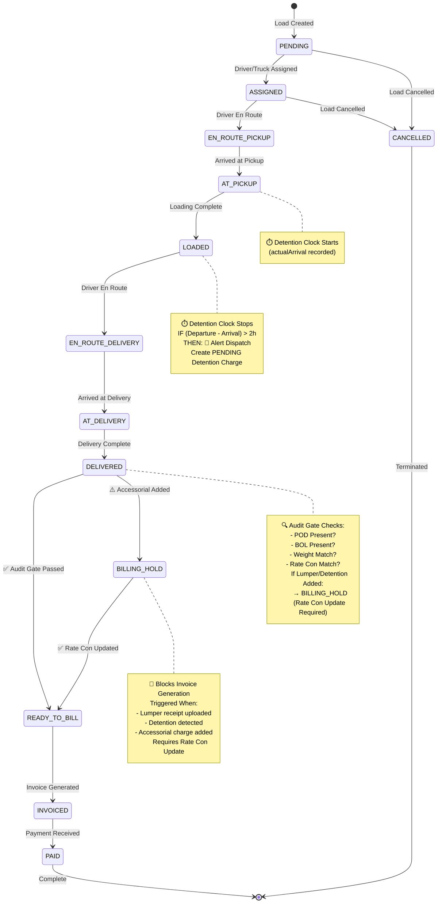

# Load Status State Machine - Visual Diagram

## Current Implementation

## Recommended Implementation (With Missing States)

## Status Transition Matrix

| Current Status | Allowed Next Statuses |
|----------------|----------------------|
| PENDING | ASSIGNED, CANCELLED |
| ASSIGNED | EN_ROUTE_PICKUP, CANCELLED |
| EN_ROUTE_PICKUP | AT_PICKUP |
| AT_PICKUP | LOADED |
| LOADED | EN_ROUTE_DELIVERY |
| EN_ROUTE_DELIVERY | AT_DELIVERY |
| AT_DELIVERY | DELIVERED |
| DELIVERED | READY_TO_BILL, BILLING_HOLD, INVOICED |
| BILLING_HOLD | READY_TO_BILL |
| READY_TO_BILL | INVOICED |
| INVOICED | PAID |
| PAID | (Terminal) |
| CANCELLED | (Terminal) |

## Key Business Rules

### Detention Detection
- **Trigger:** When `LoadStop.actualDeparture` is set
- **Calculation:** `detentionHours = (actualDeparture - actualArrival) - 2 hours free time`
- **Action:** If `detentionHours > 0`:
  - Create `AccessorialCharge` with `status: PENDING`
  - Alert dispatch
  - Set `BILLING_HOLD` if load is `DELIVERED`

### Billing Hold
- **Trigger:** When `AccessorialCharge` of type `LUMPER` or `DETENTION` is created
- **Action:**
  - Change load status to `BILLING_HOLD`
  - Block invoice generation
  - Notify accounting
- **Clear:** When `RateConfirmation` is updated with new total

### Audit Gate
- **Trigger:** When load status changes to `DELIVERED`
- **Checks:**
  - POD document present?
  - BOL document present?
  - Entered weight matches BOL weight?
  - System rate matches Rate Con amount?
- **Pass:** Status → `READY_TO_BILL`
- **Fail:** Status → `BILLING_HOLD` or `REQUIRES_REVIEW`

